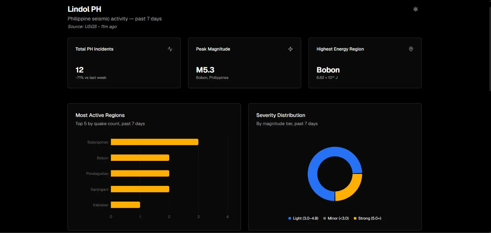

# LindolPH

A minimalist seismic analytics dashboard that surfaces real-time earthquake activity across the Philippines, available in **English** and **Filipino**. Pulls live data from the USGS Earthquake Hazards Program, isolates Philippine events, and computes estimated energy released per region using the Gutenberg-Richter energy relation.

## Live Demo

[lindol-ph.onrender.com](https://lindol-ph.onrender.com/)

> **Note:** Hosted on Render's free tier — the service sleeps after 15 minutes of inactivity. If you see a loading screen on first visit, it's waking up (takes ~30 seconds). Just wait a moment.



---

## The Problem

The Philippines sits on the Pacific Ring of Fire, making it one of the most seismically active countries in the world. PHIVOLCS monitors local activity, but their public data interface is not developer-friendly. The USGS API is free, unauthenticated, and updates continuously — but it returns global data with no regional breakdown or energy analysis out of the box.

LindolPH solves this by filtering, grouping, and computing actionable metrics from that raw global feed.

---

## Features

### Tabbed Dashboard

The dashboard is organized into three tabs — **Overview**, **Energy Table**, and **Incident Feed Table** — with the active tab persisted in the URL via `?tab=`.

### Overview Tab

Combines the KPI metrics and regional charts into a single view:

- **KPI Cards** — Total PH Incidents (with % vs last week), Peak Magnitude + location, Highest Energy Region
- **Most Active Regions** — Horizontal bar chart of top 5 regions by quake count
- **Severity Distribution** — Donut chart: Minor (< 3.0), Light (3.0–4.9), Strong (5.0+)

### Energy Table Tab

Regions ranked by total estimated seismic energy released, calculated using the Gutenberg-Richter energy relation. Columns include quake count, average magnitude, average depth, and total estimated energy in joules (scientific notation).

> **Formula:** `E = 10^(1.5M + 4.8)` joules  
> Source: Gutenberg & Richter (1956), _Earthquake magnitude, intensity, energy, and acceleration_

### Incident Feed Tab

Scrollable log of every Philippine earthquake in the dataset. Filterable by magnitude threshold and searchable by location string. Each entry shows magnitude badge, location, and humanized timestamp.

---

## Tech Stack

| Layer     | Choice                               | Reason                                 |
| --------- | ------------------------------------ | -------------------------------------- |
| Framework      | Next.js 16 (App Router) + TypeScript | `connection()` + `"use cache"` pattern |
| Styling        | Tailwind CSS + shadcn/ui             | Utility-first, accessible components   |
| Internationalization | next-intl                       | Sub-path routing (`/en/`, `/fil/`)     |
| Charts         | Recharts                             | Included via shadcn charts, composable |
| Runtime        | Bun                                  | Faster installs, native TS test runner |
| Container      | Docker (multi-stage build)           | Lean production image                  |
| Cloud          | Render (existing image from GHCR)    | GitOps pipeline, auto-deploy on push   |

---

## Architecture

```
[ USGS GeoJSON API ]
        │
        ▼ app/dal/earthquakes.ts
        │ fetch + parse, cached 1hr via "use cache" / cacheLife("hours")
        │
        ▼ lib/earthquake-analytics.ts
        │ filterPhilippineQuakes()   → isolate PH events from global feed
        │ groupByRegion()            → strip prefix, extract city/province,
        │                               sum per-quake energy via calculateTotalEnergy()
        │ getMagnitudeBuckets()      → bucket into severity tiers (skips unrated events)
        │ getMetrics()               → derive KPI values
        │
        ▼ lib/energy-calculation.ts
        │ calculateSeismicEnergy(mag)   → E = 10^(1.5M + 4.8), per single quake
        │ calculateTotalEnergy(mags)    → sums energy across a region's quakes,
        │                                  skipping unrated (null-magnitude) events
        │ sortRegionsByEnergy(groups)   → ranks already-aggregated regions descending
        │
        ─ proxy.ts
        │ locale detection → negotiate `en` or `fil` → rewrite to [locale]
        │
        ▼ app/[locale]/page.tsx
            │ <Suspense>
            │
            ▼ features/home-page/index.tsx
              │ await connection()  → defers data fetch to request time
              │
              ├── features/overview/             → KPI cards + charts
              ├── features/energy-table/          → ranked by energy release
              └── features/incident-feed-table/   → searchable, filterable log
```

### Internationalization

The app supports **English** (`/en/`) and **Filipino** (`/fil/`) via [next-intl](https://next-intl.dev). Locale is negotiated by `proxy.ts` based on the request headers, cookie, or URL prefix. A dropdown locale switcher in the header lets users switch between languages at any time. Translation strings live in `messages/{en,fil}.json`.

### Build-time vs Request-time

The page shell (heading, theme toggle, locale switcher, suspense fallback) is statically prerendered. The `HomePageContent` component calls `connection()` from `next/server` to defer data fetching to request time, preventing stale USGS data from being baked into the Docker image. At runtime, `"use cache"` in the DAL layer caches the response for 1 hour across requests.

> **Note on energy calculation:** total energy per region is summed from individual quake magnitudes, not derived from the region's average magnitude. Because the magnitude→energy relationship is exponential, converting an averaged magnitude back to energy can understate the true total by orders of magnitude whenever quake sizes vary within a region — e.g. one M7.0 alongside several smaller quakes.

---

## Project Structure

```
lindolph/
├── .github/workflows/
│   ├── ci.yml                      # Lint → typecheck → test → image → deploy
│   ├── codeql.yml                  # Security analysis
│   └── auto-target-develop.yml     # PR routing
├── i18n/
│   ├── routing.ts                  # Locale config (en, fil)
│   ├── navigation.ts               # Typed navigation helpers
│   └── request.ts                  # Request-scoped config (messages, locale)
├── messages/
│   ├── en.json                     # English UI strings
│   └── fil.json                    # Filipino UI strings
├── app/
│   ├── [locale]/
│   │   ├── layout.tsx              # Locale-scoped layout (NextIntlClientProvider)
│   │   ├── page.tsx                # Static shell → Suspense → HomePageContent
│   │   ├── not-found.tsx           # Localized 404 page
│   │   ├── error.tsx               # Sentry-captured error boundary
│   │   └── [...rest]/
│   │       └── page.tsx            # Catch-all that triggers locale 404
│   ├── layout.tsx                  # Root layout (html/body, ThemeProvider, NuqsAdapter)
│   ├── page.tsx                    # Root redirect to default locale
│   ├── global-error.tsx            # Root error boundary
│   └── globals.css
├── components/
│   ├── data-table/                 # Reusable data table primitives
│   ├── ui/                         # shadcn/ui primitives
│   ├── locale-switcher.tsx         # Language toggle dropdown
│   ├── theme-provider.tsx
│   └── mode-toggle.tsx
├── features/
│   ├── home-page/                  # Request-time data fetch + tab orchestration
│   ├── overview/                   # KPI cards + regional charts
│   ├── energy-table/               # Ranked energy release table
│   └── incident-feed-table/        # Searchable, filterable incident log
├── hooks/
│   └── use-mobile.ts               # Responsive breakpoint detection
├── lib/
│   ├── earthquake-analytics.ts     # Filter, group, aggregate utilities
│   ├── energy-calculation.ts       # Gutenberg-Richter formula + region ranking
│   ├── earthquakes.ts              # USGS data parsing utilities
│   ├── data-table-parsers.ts       # Table column definitions + formatters
│   ├── home-page-parsers.ts        # nuqs search param parsers
│   ├── relative-time.ts            # Humanized timestamps
│   ├── constants.ts                # App-wide constants
│   ├── utils.ts                    # Shared helpers
│   ├── schema/
│   │   └── usgs-feature.ts         # Valibot schema for USGS response
│   └── __tests__/
│       ├── earthquake-analytics.test.ts
│       ├── earthquakes.test.ts
│       └── energy-calculation.test.ts
├── types/
│   ├── earthquakes.ts              # TypeScript interfaces for USGS GeoJSON
│   └── data-table.ts               # Table type definitions
├── env/
│   ├── server.ts                   # T3 env: server-side validation
│   ├── client.ts                   # T3 env: client-side validation
│   └── index.ts                    # Barrel exports
├── proxy.ts                        # Locale detection + redirect (Next.js 16 middleware)
├── public/
│   └── images/
│       └── lindol-ph-preview.webp
├── secrets/                        # Local docker-compose secret files
├── instrumentation.ts              # Sentry server instrumentation
├── instrumentation-client.ts       # Sentry client instrumentation
├── sentry.server.config.ts
├── sentry.edge.config.ts
├── next.config.ts
├── Dockerfile
├── docker-compose.yml
├── .env.example
└── README.md
```

---

## Running Locally

### With Bun (default)

```bash
bun install
bun dev
```

Open [http://localhost:3000](http://localhost:3000)

### With Docker (local test)

```bash
docker compose up --build
```

Open [http://localhost:3000](http://localhost:3000)

---

## Deployment

> Full steps in [`DEPLOYMENT.md`](./DEPLOYMENT.md)

Push to `main` → GitHub Actions builds the Docker image with BuildKit secrets, pushes to GHCR, then triggers Render to pull and deploy.

---

## Data Source

**USGS Earthquake Hazards Program**  
Feed: `https://earthquake.usgs.gov/earthquakes/feed/v1.0/summary/all_week.geojson`  
License: Public domain, no authentication required  
Update frequency: Every 5 minutes at source, cached at 1 hour in this app via `"use cache"`

---

## Scientific Reference

Gutenberg, B., & Richter, C. F. (1956). Earthquake magnitude, intensity, energy, and acceleration. _Bulletin of the Seismological Society of America_, 46(2), 105–145.

> The energy values produced by this app are **estimates** for analytical and educational purposes. They are not equivalent to official PHIVOLCS or USGS energy calculations, which use more complex physics-based models.

---

## License

MIT — see [LICENSE](LICENSE).
